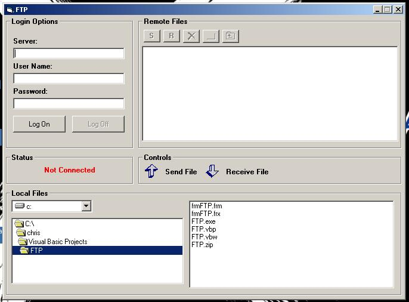



## \_A FTP Client

### Description

A simple FTP client using the Internet Transfer Control. Sends files, recieves files, gets file size, changes directory, creates directories, renames files, and much more! Great code to expand on, fully commented.
 
### More Info
 

             |
---                |---
**Submitted On**   |2003-06-22 23:02:02
**By**             |[Christopher C\.](https://github.com/Planet-Source-Code/PSCIndex/blob/master/ByAuthor/christopher-c.md)
**Level**          |Intermediate
**User Rating**    |4.7 (163 globes from 35 users)
**Compatibility**  |VB 4\.0 \(32\-bit\), VB 5\.0, VB 6\.0
**Category**       |[Internet/ HTML](https://github.com/Planet-Source-Code/PSCIndex/blob/master/ByCategory/internet-html__1-34.md)
**World**          |[Visual Basic](https://github.com/Planet-Source-Code/PSCIndex/blob/master/ByWorld/visual-basic.md)
**Archive File**   |[\_A\_FTP\_Cli1605156242003\.zip](https://github.com/Planet-Source-Code/christopher-c-a-ftp-client__1-46394/archive/master.zip)

